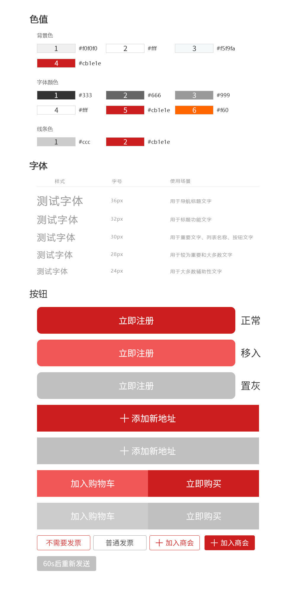

# 移动端UI组件库
- [在线地址](http://dptwx.irddtest.cn/mcUILib/page/index.html) 
## 用法
- 安装 npm install mobile-ui-lib --save-dev
- 主题风格引入 @import "~mobile-ui-lib/src/stylesheets/themes/themes.scss";
- mixin引入 @import "~mobile-ui-lib/src/stylesheets/helps/mixin.scss";
- 全局引入 @import "~mobile-ui-lib/src/stylesheets/mobile-ui-lib.scss";
```
// 全局引入基础模块
<style scoped lang="sass">
  @import "~mobile-ui-lib/src/stylesheets/mobile-ui-lib.scss";
</style>  
```
- 字体图标库引入 @import "~mobile-ui-lib/src/stylesheets/font/iconfont.scss";
```
// 入口文件 引入 字体图标库
<script>
  import 'mobile-ui-lib/src/stylesheets/global/iconfont.scss'
</script> 
```
- 局部模块引入 @import "~mobile-ui-lib/src/stylesheets/modules/**.scss";
```
// 局部模块引入
<script>
  @import "~mobile-ui-lib/src/stylesheets/modules/header.scss";
  @import "~mobile-ui-lib/src/stylesheets/modules/search.scss";
  @import "~mobile-ui-lib/src/stylesheets/modules/tabBar.scss";
</script> 
```
## 技术选型
- html5/html
- css/css3
- scss/sass
## 基础组件
- 按钮（button）
- 弹性盒子（flex）
- 表单（form）
- 图标（icon）
- 列表（list）
## 电商组件（扩展组件）
- 页头（header）
- 页脚（footer）
- 搜索（search）
- 待扩展
## 目录结构
     	
      			
```
.mcUILib                                        移动端UI组件库   
└── src                                   
    └── global                                    基础组件  
        └── button                                按钮
            ├── button.html
            ├── button.scss
            ├── button.css
            └── button.css.map  	
        └── flex                                  弹性盒子
            ├── flex.html                         
            ├── flex.scss
            ├── flex.css
            └── flex.css.map
        └── form                                   表单
            ├── form.html
            ├── form.scss
            ├── form.css
            └── form.css.map  
        └── icon                                  图标
            ├── iconFontclass.html
            ├── iconSymbol.html
            ├── iconUnicode.html
            └── icon.css  
        └── list                                   列表 
            ├── list.html
            ├── list.scss
            ├── list.css
            └── list.css.map    
    └── images                                    图片/图标
        ├── global                                全局图标/图片
        └── modules                               电商组件（扩展组件）图片/图标
            ├── header                            页头图片/图标
            ├── footer                            页尾图片/图标
            └── search 	                        搜索图片/图标
    └── modules                                   电商组件（扩展组件）
        └── header                                页头
            ├── header.html
            ├── header.scss
            ├── header.css
            └── header.css.map
        └── tabBar                                标签栏
            ├── tabBar.html
            ├── tabBar.scss
            ├── tabBar.css
            └── tabBar.css.map  	
        └── search                                搜索
            ├── search.html
            ├── search.scss
            ├── search.css
            └── search.css.map  
    └── stylesheets                               样式库
        └── global                                全局样式/基础样式
            ├── font
            ├── base.scss
            ├── base.css
            ├── base.css.map
            ├── button.scss
            ├── button.css
            ├── button.css.map
            ├── flex.scss
            ├── flex.css
            ├── flex.css.map
            ├── form.scss
            ├── form.css
            ├── form.css.map
            ├── layout.scss
            ├── layout.css
            ├── layout.css.map
            ├── list.scss
            ├── list.css
            ├── list.css.map
            ├── reset.scss
            ├── reset.css
            └── reset.css.map  
        └── helps                                 存放通用混合宏或变量
            ├── mixin.scss
            ├── mixin.css
            └── mixin.css.map 
        └── modules                               电商组件（扩展组件）核心样式库
            ├── header.scss
            ├── header.css
            ├── header.css.map
            ├── tabBar.scss
            ├── tabBar.css
            ├── tabBar.css.map  	
            ├── search.scss
            ├── search.css
            └── search.css.map  
        └── themes                                主体风格
            ├── themes.scss
            ├── themes.css
            └── themes.css.map
        └── vendors                               第三方样式库
    └── temp                                      临时图片，后续到项目中会直接删除的                                
        ├── global
        └── modules 
            ├── header
            ├── tabBar
            └── search                     
```
## UI设计规范
- 设计稿分辨率要求统一为750*1334
- 主体风格及常用样式规范见图

- [字体图标库地址](http://www.iconfont.cn/) 

## HTML5基础模板
```html
<!DOCTYPE html>
<html>
<head>
    <title>网易版字体尺寸全部根据rem配置(http://www.cnblogs.com/axl234/p/5156956.html)</title>
    <meta charset="utf-8">
    <meta content="yes" name="apple-mobile-web-app-capable">
    <meta content="yes" name="apple-touch-fullscreen">
    <meta name="format-detection" content="telephone=no, email=no"/>
    <!-- 优先使用 IE 最新版本和 Chrome -->
    <meta http-equiv="X-UA-Compatible" content="IE=edge,chrome=1"/>

    <!-- 页面描述 -->
    <meta name="description" content="不超过150个字符"/>

    <!-- 页面关键词 -->
    <meta name="keywords" content=""/>

    <!-- 搜索引擎抓取 -->
    <meta name="robots" content="index,follow"/>

    <!-- 启用360浏览器的极速模式(webkit) -->
    <meta name="renderer" content="webkit">

    <!-- 避免IE使用兼容模式 -->
    <meta http-equiv="X-UA-Compatible" content="IE=edge">

    <!-- 不让百度转码 -->
    <meta http-equiv="Cache-Control" content="no-siteapp"/>

    <!-- 针对手持设备优化，主要是针对一些老的不识别viewport的浏览器，比如黑莓 -->
    <meta name="HandheldFriendly" content="true">

    <!-- 微软的老式浏览器 -->
    <meta name="MobileOptimized" content="320">

    <!-- uc强制竖屏 -->
    <meta name="screen-orientation" content="portrait">
    <!-- QQ强制竖屏 -->

    <meta name="x5-orientation" content="portrait">
    <!-- UC强制全屏 -->
    <meta name="full-screen" content="yes">
    <!-- QQ强制全屏 -->

    <meta name="x5-fullscreen" content="true">
    <!-- UC应用模式 -->
    <meta name="browsermode" content="application">
    <!-- QQ应用模式 -->
    <meta name="x5-page-mode" content="app">
    <meta name="viewport" content="width=device-width, user-scalable=no, initial-scale=1.0, maximum-scale=1.0, minimum-scale=1.0">
    <link rel="apple-touch-icon" href="favicon.png">
    <link rel="Shortcut Icon" href="favicon.png" type="image/x-icon">
</head>
<body>
<!--code-->
</body>
</html>
```
## 移动端适配方案
###根据UI设计根据750*1334进行设计，故调整为网易版字体尺寸全部根据rem配置(http://www.cnblogs.com/axl234/p/5156956.html)
1.在页面顶部引入如下js代码
```js
<script type="text/javascript">
        (function (doc, win) {
            var docEl = doc.documentElement, resizeEvt = 'orientationchange' in window ? 'orientationchange' : 'resize', recalc = function () {
                var clientWidth = docEl.clientWidth;
                if (!clientWidth) return;
                document.documentElement.style.fontSize = document.documentElement.clientWidth / 7.5 + 'px';
            };
            if (!doc.addEventListener) return;
            win.addEventListener(resizeEvt, recalc, false);
            doc.addEventListener('DOMContentLoaded', recalc, false);
        })(document, window);
    </script>
```
2.开发页面时，包括字体全部用rem替换px，另外需要进行px换算rem,如：设计稿宽度为50px,这，在样式表定义时，定义为.5rem,具体demo如下：
```css
div {
    width:.5rem
}
```
## 开发注意事项
### HTML5
- 避免嵌套多层
- 标签统一小写，如：
```html
<!--错误书写方式-->
<SPAN>
    
</SPAN>
<!--正确书写方式-->
<span>
    
</span>
```
- 标签必须闭合
- 一个页面由多个模块或组件组成，应标明注释，如下：
```html
<body>
    <!--页头-->
    <header>
        我是页头
    </header>
    <!--end 页头-->
    <!--页脚-->
    <footer>
        我是页脚
    </footer>
    <!--end 页脚-->
</body>
```
- 页面布局上涉及到页面逻辑需要后端处理或者说在嵌套数据的时候需要注意的地方应标明注释
- 开发每个模块之前优先考虑下命名规范，再次考虑下是否有其他页面用到类似或者一样的组件是否可以通用等，最后考虑嵌套逻辑是否复杂，有什么方法调整布局可以减少嵌套数据时的逻辑处理的方法等。如下：
```html
<!--普遍的实现方案-->
<style>
    ul {
        li {
            border:1px solid red;
            &.last {
                border: 0;
            }
        }
    }
</style>
<ul>
    <li>我是列表</li>
    <li>我是列表</li>
    <li class="last">我是列表</li>
</ul>

<!--优化后的实现方案-->
<style>
    ul {
        li {
            border:1px solid red;
            &.last-child {
                border: 0;
            }
        }
    }
</style>
<ul>
    <li>我是列表</li>
    <li>我是列表</li>
    <li>我是列表</li>
</ul>
```
### CSS3 
- 公共基础模块为每个项目开发中必须的不可或缺的一部分，如：button\flex\form\icon\list等，命名前缀统一为'g-',一般为global文件夹下的
- 通用模块为多个不同页面的部分模块所共用的部分，命名前缀统一为'm-',一般为modules文件夹下的
- 页面为基础模块与通用模块组成的一个页面，如果涉及到页面上独有的样式需要定义，css命名统一为页面名字，如果名字过长，可用缩写但一定要保证与其他页面命名不冲突
- css中的id\class等选择器命名统一用'-'中划线来分隔
例如：
```css
.g-button {} // 基础模块
.m-button {} // 通用模块
.button {}   // 页面
```
## 文件及文件夹命名规范
- 文件夹命名统一用驼峰命名法，如：
```
├── order
    ├── orderList.html
    ├── orderDetail.html
    └── orderDetail.html
```